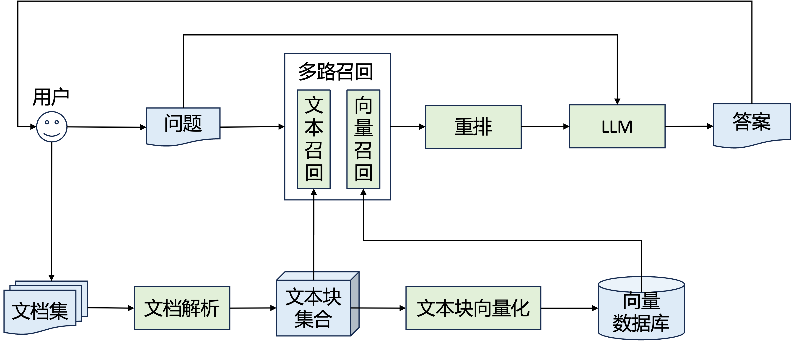

```python
import os
os.environ["CUDA_VISIBLE_DEVICES"] = "2,3"
print(os.environ["CUDA_VISIBLE_DEVICES"])
```

    2,3


#### 项目概述
**基于大模型的文档检索问答**
项目要求以大模型为中心制作一个问答系统，回答用户的汽车相关问题。需要根据问题，在文档中定位相关信息的位置，并根据文档内容通过大模型生成相应的答案。
#### 项目流程图



```python
from retrievers.faiss_retriever import FaissRetriever
from vllm_model import Baichuan
from run import *
```

    /home/lixy/anaconda3/envs/llm/lib/python3.9/site-packages/tqdm/auto.py:21: TqdmWarning: IProgress not found. Please update jupyter and ipywidgets. See https://ipywidgets.readthedocs.io/en/stable/user_install.html
      from .autonotebook import tqdm as notebook_tqdm
    2024-11-30 12:21:27,770	INFO util.py:154 -- Missing packages: ['ipywidgets']. Run `pip install -U ipywidgets`, then restart the notebook server for rich notebook output.


```python
data =  parse_pdf('data/train_a.pdf')

```

    1220
    8178
    8785
    data load ok


**改进1：采取更多路召回策略**
支持使用多个文本检索、向量检索，包括TF-IDF召回，m3e召回、bge召回、gte召回和bce召回，支持使用bge-reranker或bce-reranker-base_v1进行精排


```python
retrievers = []
for embed_model in ['m3e']:
    retrievers.append(FaissRetriever(embed_model, data))
print("faissretriever load ok")
```

    /home/lixy/RAG/retrievers/faiss_retriever.py:24: LangChainDeprecationWarning: The class `HuggingFaceEmbeddings` was deprecated in LangChain 0.2.2 and will be removed in 1.0. An updated version of the class exists in the :class:`~langchain-huggingface package and should be used instead. To use it run `pip install -U :class:`~langchain-huggingface` and import as `from :class:`~langchain_huggingface import HuggingFaceEmbeddings``.
      self.embeddings  = HuggingFaceEmbeddings(
    No sentence-transformers model found with name ./pre_train_model/m3e-large. Creating a new one with mean pooling.


    faissretriever load ok


```python
# BM25召回
retrievers.append(BM25(data))
print("bm25 load ok")

# TFIDF召回
retrievers.append(TFIDF(data))
print("tfidf load ok")
```

    Building prefix dict from the default dictionary ...
    Loading model from cache /tmp/jieba.cache
    Loading model cost 0.664 seconds.
    Prefix dict has been built successfully.


    bm25 load ok
    tfidf load ok


```python
# reRank模型
rerank = reRankLLM("pre_train_model/bce-reranker-base")
print("rerank model load ok")
```

    rerank model load ok


**改进2：可配置基座大模型**
LLM分别采用ChatGLM3-6B, Qwen1.5-7B-Chat和Baichuan2-7B-Chat作为大模型基座，代码做成可配置。


```python
# LLM大模型
llm_dict = {
        "qwen": (ChatLLM, "pre_train_model/Qwen1.5-7B-Chat"),
        "baichuan": (ChatLLM, "pre_train_model/Baichuan2-7B-Chat"),
        "chatglm": (Baichuan, "pre_train_model/chatglm3-6b")
    }
llm_name = "qwen"
llm_model, llm_path = llm_dict[llm_name]
llm = llm_model(llm_path)
print(f"llm {llm_name} load ok")
```

    WARNING 11-30 12:26:32 config.py:1354] Casting torch.bfloat16 to torch.float16.
    INFO 11-30 12:26:32 config.py:698] Defaulting to use mp for distributed inference
    INFO 11-30 12:26:32 llm_engine.py:169] Initializing an LLM engine (v0.5.1) with config: model='pre_train_model/Qwen1.5-7B-Chat', speculative_config=None, tokenizer='pre_train_model/Qwen1.5-7B-Chat', skip_tokenizer_init=False, tokenizer_mode=auto, revision=None, rope_scaling=None, rope_theta=None, tokenizer_revision=None, trust_remote_code=True, dtype=torch.float16, max_seq_len=32768, download_dir=None, load_format=LoadFormat.AUTO, tensor_parallel_size=2, pipeline_parallel_size=1, disable_custom_all_reduce=False, quantization=None, enforce_eager=False, kv_cache_dtype=auto, quantization_param_path=None, device_config=cuda, decoding_config=DecodingConfig(guided_decoding_backend='outlines'), observability_config=ObservabilityConfig(otlp_traces_endpoint=None), seed=0, served_model_name=pre_train_model/Qwen1.5-7B-Chat, use_v2_block_manager=False, enable_prefix_caching=False)
    INFO 11-30 12:26:32 selector.py:153] Cannot use FlashAttention-2 backend for Volta and Turing GPUs.
    INFO 11-30 12:26:32 selector.py:53] Using XFormers backend.
    (VllmWorkerProcess pid=1291575) INFO 11-30 12:26:35 selector.py:153] Cannot use FlashAttention-2 backend for Volta and Turing GPUs.
    (VllmWorkerProcess pid=1291575) INFO 11-30 12:26:35 selector.py:53] Using XFormers backend.
    (VllmWorkerProcess pid=1291575) INFO 11-30 12:26:36 multiproc_worker_utils.py:215] Worker ready; awaiting tasks
    (VllmWorkerProcess pid=1291575) INFO 11-30 12:26:36 utils.py:741] Found nccl from library libnccl.so.2
    (VllmWorkerProcess pid=1291575) INFO 11-30 12:26:36 pynccl.py:63] vLLM is using nccl==2.20.5
    INFO 11-30 12:26:36 utils.py:741] Found nccl from library libnccl.so.2
    INFO 11-30 12:26:36 pynccl.py:63] vLLM is using nccl==2.20.5
    INFO 11-30 12:26:36 custom_all_reduce_utils.py:232] reading GPU P2P access cache from /home/lixy/.config/vllm/gpu_p2p_access_cache_for_2,3.json
    (VllmWorkerProcess pid=1291575) INFO 11-30 12:26:36 custom_all_reduce_utils.py:232] reading GPU P2P access cache from /home/lixy/.config/vllm/gpu_p2p_access_cache_for_2,3.json
    INFO 11-30 12:26:36 selector.py:153] Cannot use FlashAttention-2 backend for Volta and Turing GPUs.
    INFO 11-30 12:26:36 selector.py:53] Using XFormers backend.
    (VllmWorkerProcess pid=1291575) INFO 11-30 12:26:36 selector.py:153] Cannot use FlashAttention-2 backend for Volta and Turing GPUs.
    (VllmWorkerProcess pid=1291575) INFO 11-30 12:26:36 selector.py:53] Using XFormers backend.
    INFO 11-30 12:26:41 model_runner.py:255] Loading model weights took 7.2313 GB
    (VllmWorkerProcess pid=1291575) INFO 11-30 12:26:46 model_runner.py:255] Loading model weights took 7.2313 GB
    INFO 11-30 12:26:51 distributed_gpu_executor.py:56] # GPU blocks: 3989, # CPU blocks: 1024
    INFO 11-30 12:26:53 model_runner.py:924] Capturing the model for CUDA graphs. This may lead to unexpected consequences if the model is not static. To run the model in eager mode, set 'enforce_eager=True' or use '--enforce-eager' in the CLI.
    INFO 11-30 12:26:53 model_runner.py:928] CUDA graphs can take additional 1~3 GiB memory per GPU. If you are running out of memory, consider decreasing `gpu_memory_utilization` or enforcing eager mode. You can also reduce the `max_num_seqs` as needed to decrease memory usage.
    (VllmWorkerProcess pid=1291575) INFO 11-30 12:26:53 model_runner.py:924] Capturing the model for CUDA graphs. This may lead to unexpected consequences if the model is not static. To run the model in eager mode, set 'enforce_eager=True' or use '--enforce-eager' in the CLI.
    (VllmWorkerProcess pid=1291575) INFO 11-30 12:26:53 model_runner.py:928] CUDA graphs can take additional 1~3 GiB memory per GPU. If you are running out of memory, consider decreasing `gpu_memory_utilization` or enforcing eager mode. You can also reduce the `max_num_seqs` as needed to decrease memory usage.


    INFO 11-30 12:27:19 custom_all_reduce.py:219] Registering 2275 cuda graph addresses
    (VllmWorkerProcess pid=1291575) INFO 11-30 12:27:19 custom_all_reduce.py:219] Registering 2275 cuda graph addresses
    (VllmWorkerProcess pid=1291575) INFO 11-30 12:27:19 model_runner.py:1117] Graph capturing finished in 26 secs.
    INFO 11-30 12:27:19 model_runner.py:1117] Graph capturing finished in 26 secs.
    llm qwen load ok


利用prompt技术增强query来提升检索效果


```python
query = "如何通过中央显示屏进行副驾驶员座椅设置？"
queries = [query]
```

**改进3：检索前改写问题**
先用LLM先将问题改写和扩充一遍，然后将问题和这个改写后的问题拼接，提升检索效果。


```python
queries.append(llm.infer([rephrase_question_template(query)])[0])
```

    Processed prompts: 100%|██████████| 1/1 [00:00<00:00,  1.02it/s, est. speed input: 69.13 toks/s, output: 49.81 toks/s]


**改进4: 先生成答案再检索**
先用LLM直接生成答案，然后将问题和这个生成的答案拼接，共同完成检索，提升检索效果。


```python
answer = llm.infer([answer_question_template(query)])[0]
if answer.strip() != "无答案":
    queries.append(query+" "+answer)
```

    Processed prompts: 100%|██████████| 1/1 [00:05<00:00,  5.60s/it, est. speed input: 12.15 toks/s, output: 45.04 toks/s]


原始问题和通过上述两种方式扩展后的问题列表如下所示：


```python
for q in queries:
    print(q)
    print('------------------')
```

    如何通过中央显示屏进行副驾驶员座椅设置？
    ------------------
    如何在车辆中央控制台上详细指导操作，以配置副驾驶座椅的各个功能设置，包括但不限于调节位置、安全带警告、记忆功能、角度调整等，并且适用于所有具备中央显示屏控制座椅设置的车型？
    ------------------
    如何通过中央显示屏进行副驾驶员座椅设置？ 在许多现代汽车中，中央显示屏通常用于控制车内的一些便利功能，包括座椅设置。具体步骤可能会因车型而异，但通常步骤如下：
    
    1. 打开中央显示屏：首先，找到中控台上的触摸屏或旋钮，通常标有"多媒体"、"信息中心"或"设置"等字样。
    
    2. 寻找座椅设置选项：在主菜单中，找到"座椅"、"乘客设置"或"座椅记忆"等选项。这通常在"车辆设置"或"座椅"部分。
    
    3. 选择副驾驶座椅：在座椅设置菜单中，选择"副驾驶"或"第二排座椅"。
    
    4. 进行调整：根据需要，可以调整座椅位置（如前后移动、高低调节、靠背角度等），然后保存设置。具体操作可能会有图标指示，如向上的箭头表示升高，向下的箭头表示降低。
    
    5. 确认保存：完成所有设置后，确认保存设置，或者直接按"确认"或"返回"键。
    
    请根据你的车辆型号和具体操作界面进行操作，如果不确定，可以查看车辆使用手册或联系车辆制造商获取帮助。
    ------------------


```python
batch_context = []
for q in queries:            
    docs = retrievers_recall(retrievers, q)
    batch_context.append(reRank(rerank, 6, q, docs))

```

    /home/lixy/RAG/retrievers/bm25_retriever.py:39: LangChainDeprecationWarning: The method `BaseRetriever.get_relevant_documents` was deprecated in langchain-core 0.1.46 and will be removed in 1.0. Use :meth:`~invoke` instead.
      ans_docs = self.retriever.get_relevant_documents(query)


```python
batch_qa_inputs = [qa_template(''.join(context), query) for context in batch_context]
batch_qa_outputs = llm.infer(batch_qa_inputs)
```

    Processed prompts: 100%|██████████| 3/3 [00:11<00:00,  3.76s/it, est. speed input: 617.77 toks/s, output: 50.76 toks/s]


**改进5：先整理检索文档再回答**

将抽取后的文档使用LLM重新整理，使得杂乱知识库规整。然后再送入到答案生成模块


```python
rephrase_inputs = [rephrase_context_template(''.join(context)) for context in batch_context]
rephrase_context = llm.infer(rephrase_inputs)
batch_qa_inputs += [qa_template(''.join(context), query) for context in rephrase_context]
```

    Processed prompts: 100%|██████████| 3/3 [00:23<00:00,  7.79s/it, est. speed input: 293.80 toks/s, output: 48.87 toks/s]


```python
rephrase_context
```


    ['座椅调节指南：\n\n1. 调节副驾驶座椅：\n   - 后端向上/下拨动控制按钮，调节座椅高度。\n   - 前端向上/下拨动控制按钮，调节座垫角度。\n   - 中央显示屏进入座椅设置界面，选择副驾驶座椅，调节靠背、座椅位置等。\n   - 按照指示箭头，通过控制按钮或中央显示屏调节座椅功能。\n\n2. 调节前排座椅：\n   - 前排座椅加热：通过中央显示屏设置加热强度或关闭，分三级调节（关-低-中-高）。\n   - 前排座椅通风：同样通过中央显示屏设置通风强度或关闭，分三级调节。\n\n3. 注意事项：\n   - 对于无法感知座椅温度的乘客，如病人、残疾人等，避免使用前排座椅加热功能。\n   - 使用Lynk&CoApp可以打开/关闭座椅加热和通风，具体操作在App中进行。\n   - 副驾驶座椅位置电动调节，包括前后位置和靠背角度，通过控制按钮或中央显示屏调节。\n\n4. 安全出行：\n   - 调节座椅功能前，确保安全，避免在行驶中操作。\n\n总结：通过中央显示屏，用户可以便捷地调节副驾驶和前排座椅的多项功能，包括座椅高度、座垫角度、加热和通风强度等。在操作时需注意乘客舒适度和安全。',
     '座椅调节与功能介绍：\n\n1. 调节方法：\n   - 向上/下拨动后端控制按钮调节座椅高度。\n   - 向前/后拨动控制按钮调节座椅靠背角度和前后位置。\n   - 通过中央显示屏，选择“座舱体验-座椅”，进入座椅设置界面，针对驾驶员座椅进行具体功能调节。\n\n2. 驾驶前准备：\n   - 确保座椅正常操作制动踏板和加速踏板，座椅位置尽量靠后以保证舒适和操控便利。\n   - 设置位置记忆功能，选择“位置一”/“位置二”/“位置三”，存储座椅位置。\n   - 警告：车辆行驶时勿调节座椅，勿使用位置记忆功能。\n\n3. 座椅功能：\n   - 驾驶座椅可调节靠背、座椅位置。\n   - 副驾驶座椅电动调节，包括前后位置、靠背角度和高度。\n   - 前排座椅加热和通风可通过中央显示屏进行强度设置或关闭。\n\n4. 安全出行提示：\n   - 前排座椅加热和通风功能需注意适用人群，如有身体感知问题，应避免使用。\n   - 使用Lynk&CoApp可远程控制座椅加热和通风。\n\n5. 控制方式：\n   - 方向盘左侧键盘可操作驾驶辅助系统。\n   - 按下恢复键可恢复驾驶辅助功能。\n   - 副驾驶座椅的调节包括前后位置、靠背角度和高度。\n\n6. 注意事项：\n   - 座椅移动时避免阻碍，以防损坏。\n   - 调节座椅位置时，若手动操作，座椅将停止移动。\n\n总结：车辆座椅提供多种调节功能，包括高度、角度和位置，驾驶前需进行适当设置，如位置记忆和座椅加热通风。在行驶中需遵守相关警告，避免操作座椅功能。',
     '以下是重新组织和总结后的文档内容：\n\n1. 座椅调节：\n   - 通过后端向上/下拨动控制按钮调节座椅高度。\n   - 前端向上/下拨动控制按钮调节座垫角度。\n   - 中央显示屏可进入座椅设置界面，选择副驾驶座椅，调节靠背、座椅位置等。\n   - 副驾驶座椅位置可电动调节，包括前后位置、靠背角度和高度。\n\n2. 副驾驶座椅设置：\n   - 副驾驶座椅可通过中央显示屏设置，包括座椅位置电动调节。\n   - 前后位置通过向前/后拨动控制按钮调节。\n   - 靠背角度同样可通过控制按钮调节。\n\n3. 前排座椅加热：\n   - 设计目的是提高环境舒适度，可通过中央显示屏设置加热强度或关闭功能。\n   - 驾驶员和副驾驶座椅加热强度可独立控制。\n\n4. 安全出行提示：\n   - 禁止在车辆行驶时调节驾驶员座椅。\n   - 开车前应确保座椅位置适合操作制动踏板和加速踏板。\n\n5. 座椅位置记忆功能：\n   - 可存储驾驶员座椅、外后视镜位置，通过中央显示屏设置。\n   - 存储位置选择后，点击“保存”按钮存储记忆位置，点击“恢复”移动至已存储位置。\n   - 注意在行驶时勿使用此功能，避免阻碍座椅移动导致损坏。\n\n6. 方向盘操作：\n   - 多功能方向盘提供驾驶辅助系统、抬头显示（HUD）等操作。\n   - 左侧键盘操作驾驶辅助系统，右侧键盘操作抬头显示、多媒体等。\n\n7. 驾驶前准备：\n   - 调整座椅位置以确保舒适和操控方便，位置记忆功能可存储座椅位置。\n\n通过以上内容，可以清晰地了解车辆座椅调节、加热、安全出行提示、座椅记忆功能以及多功能方向盘的使用方法。']


**改进6：递归生成答案**

一次给LLM一个检索到的文档，不断优化生成的答案，即利用prompt技术对LLM，context和原答案，优得到优化升级后的答案。


```python
for i in range(len(batch_context[0])):
    if i==0:
        recursive_qa_inputs = [qa_template(batch_context[0][i], query)]
    else:
        recursive_qa_inputs = [recursive_qa_template(batch_context[0][i], recursive_qa_outputs[0], query)]
    recursive_qa_outputs = llm.infer(recursive_qa_inputs)
    print(f"round {i}")
    print(recursive_qa_inputs[0])
    # print(recursive_qa_outputs[0])
batch_qa_outputs += recursive_qa_outputs
```

    Processed prompts: 100%|██████████| 1/1 [00:03<00:00,  3.64s/it, est. speed input: 110.54 toks/s, output: 47.02 toks/s]


    round 0
    基于以下已知信息，简洁和专业的来回答用户的问题。
        如果无法从中得到答案，请说 "无答案" ，不允许在答案中添加编造成分，答案请使用中文。
        已知文档内容为吉利控股集团汽车销售有限公司的吉利用户手册。
        问题: 如何通过中央显示屏进行副驾驶员座椅设置？
        文档内容: 03向上/下拨动控制按钮后端，调节座椅高度。04向上/下拨动控制按钮前端，调节座垫角度。中央显示屏调节副驾驶员座椅在中央显示屏中点击-座舱体验-座椅，进入座椅设置界面。1选择副驾驶员座椅，点击需要调节的座椅功能按键（靠背、座椅位置等）。安全出行2点击、等指示箭头，调节选择的座椅功能。调节副驾驶座椅副驾驶座椅位置电动调节01向前/后拨动控制按钮，调节座椅前后位置。02向前/后拨动控制按钮，调节座椅靠背角度。03向上/下拨动控制按钮后端，调节座椅高度。中央显示屏调节副驾驶员座椅在中央显示屏中点击-座舱体验-座椅，进入座椅设置界面。1选择副驾驶员座椅，点击需要调节的座椅功能按键（靠背、座椅位置等）。安全出行2点击、等指示箭头，调节选择的座椅功能。前排座椅加热通过中央显示屏调节设计前排座椅加热功能的目的在于通过加热前排座椅，提高环境舒适度。您可以通过中央显示屏，设置驾驶员/副驾驶员侧座椅加热强度或关闭座椅加热功能。在中央显示屏中点击，进入驾驶员侧座椅加热控制界面。01设置驾驶员侧座椅加热强度及开关控制。在中央显示屏中点击，进入副驾驶员侧座椅加热控制界面。
        答案: 


    Processed prompts: 100%|██████████| 1/1 [00:04<00:00,  4.37s/it, est. speed input: 138.54 toks/s, output: 46.03 toks/s]


    round 1
    基于当前生成的答案以及一个相关文档，简洁和专业的来回答用户的问题。
        如果无法从中得到答案，请说 "无答案" ，不允许在答案中添加编造成分，答案请使用中文。
        当前答案基于前几轮内容生成，请结合新文档内容对答案进行优化，使其更准确、更全面。
        文档内容为吉利控股集团汽车销售有限公司的吉利用户手册。
        问题: 如何通过中央显示屏进行副驾驶员座椅设置？
        当前答案: 通过中央显示屏调节副驾驶员座椅设置的步骤如下：
    
    1. 打开中央显示屏，进入"座舱体验"菜单。
    2. 选择"座椅"选项，进入座椅设置界面。
    3. 选择副驾驶员座椅。
    4. 点击需要调节的座椅功能按键，如靠背、座椅位置等。
    5. 按照指示箭头，进行具体调节操作：
       - 前向/后拨动控制按钮调节座椅前后位置。
       - 向上/下拨动控制按钮后端调节座椅高度。
       - 如果有电动调节功能，还可以使用向前/后拨动按钮调节靠背角度。
    
    请注意，如果有关于座椅加热的设置，可以在同一界面找到驾驶员和副驾驶座椅加热控制，包括设置加热强度和开关控制。
        新文档内容: 04向上/下拨动控制按钮前端，调节座垫角度。中央显示屏调节副驾驶员座椅在中央显示屏中点击-座舱体验-座椅，进入座椅设置界面。1选择副驾驶员座椅，点击需要调节的座椅功能按键（靠背、座椅位置等）。安全出行2点击、等指示箭头，调节选择的座椅功能。调节副驾驶座椅副驾驶座椅位置电动调节01向前/后拨动控制按钮，调节座椅前后位置。02向前/后拨动控制按钮，调节座椅靠背角度。03向上/下拨动控制按钮后端，调节座椅高度。中央显示屏调节副驾驶员座椅在中央显示屏中点击-座舱体验-座椅，进入座椅设置界面。1选择副驾驶员座椅，点击需要调节的座椅功能按键（靠背、座椅位置等）。安全出行2点击、等指示箭头，调节选择的座椅功能。前排座椅加热通过中央显示屏调节设计前排座椅加热功能的目的在于通过加热前排座椅，提高环境舒适度。您可以通过中央显示屏，设置驾驶员/副驾驶员侧座椅加热强度或关闭座椅加热功能。在中央显示屏中点击，进入驾驶员侧座椅加热控制界面。01设置驾驶员侧座椅加热强度及开关控制。在中央显示屏中点击，进入副驾驶员侧座椅加热控制界面。安全出行01设置副驾驶员侧座椅加热强度及开关控制。
        答案: 


    Processed prompts: 100%|██████████| 1/1 [00:05<00:00,  5.50s/it, est. speed input: 117.58 toks/s, output: 44.34 toks/s]


    round 2
    基于当前生成的答案以及一个相关文档，简洁和专业的来回答用户的问题。
        如果无法从中得到答案，请说 "无答案" ，不允许在答案中添加编造成分，答案请使用中文。
        当前答案基于前几轮内容生成，请结合新文档内容对答案进行优化，使其更准确、更全面。
        文档内容为吉利控股集团汽车销售有限公司的吉利用户手册。
        问题: 如何通过中央显示屏进行副驾驶员座椅设置？
        当前答案: 如何通过中央显示屏进行副驾驶员座椅设置：
    
    1. 打开中央显示屏，进入"座舱体验"菜单。
    2. 选择"座椅"选项，进入座椅设置界面。
    3. 选择副驾驶员座椅。
    4. 点击需要调节的座椅功能按键，如靠背、座椅位置等。
    5. 按照指示操作：
       - 向上/下拨动控制按钮前端，调节座垫角度。
       - 向前/后拨动控制按钮，调节座椅前后位置。
       - 如果有电动调节，还可以调整靠背角度，通过向前/后拨动按钮。
    6. 注意，副驾驶座椅位置的调节可能包括前后和高度，具体操作可能有细微变化。
    7. 如果需要，可以设置副驾驶座椅的加热强度和开关，进入相应控制界面进行操作。
    
    安全出行时，请确保按照屏幕指示进行操作，以确保座椅设置的正确性和舒适性。
        新文档内容: 中央显示屏调节副驾驶员座椅在中央显示屏中点击-座舱体验-座椅，进入座椅设置界面。1选择副驾驶员座椅，点击需要调节的座椅功能按键（靠背、座椅位置等）。安全出行2点击、等指示箭头，调节选择的座椅功能。调节副驾驶座椅副驾驶座椅位置电动调节01向前/后拨动控制按钮，调节座椅前后位置。02向前/后拨动控制按钮，调节座椅靠背角度。03向上/下拨动控制按钮后端，调节座椅高度。中央显示屏调节副驾驶员座椅在中央显示屏中点击-座舱体验-座椅，进入座椅设置界面。1选择副驾驶员座椅，点击需要调节的座椅功能按键（靠背、座椅位置等）。安全出行2点击、等指示箭头，调节选择的座椅功能。前排座椅加热通过中央显示屏调节设计前排座椅加热功能的目的在于通过加热前排座椅，提高环境舒适度。您可以通过中央显示屏，设置驾驶员/副驾驶员侧座椅加热强度或关闭座椅加热功能。在中央显示屏中点击，进入驾驶员侧座椅加热控制界面。01设置驾驶员侧座椅加热强度及开关控制。在中央显示屏中点击，进入副驾驶员侧座椅加热控制界面。安全出行01设置副驾驶员侧座椅加热强度及开关控制。驾驶员/副驾驶员侧座椅加热分三级调节，点击控制开关后在“关-低-中-高”之间循环。
        答案: 


    Processed prompts: 100%|██████████| 1/1 [00:07<00:00,  7.21s/it, est. speed input: 139.90 toks/s, output: 37.71 toks/s]


    round 3
    基于当前生成的答案以及一个相关文档，简洁和专业的来回答用户的问题。
        如果无法从中得到答案，请说 "无答案" ，不允许在答案中添加编造成分，答案请使用中文。
        当前答案基于前几轮内容生成，请结合新文档内容对答案进行优化，使其更准确、更全面。
        文档内容为吉利控股集团汽车销售有限公司的吉利用户手册。
        问题: 如何通过中央显示屏进行副驾驶员座椅设置？
        当前答案: 如何通过中央显示屏进行副驾驶员座椅设置：
    
    1. 打开中央显示屏，进入"座舱体验"菜单。
    2. 选择"座椅"选项，进入座椅设置界面。
    3. 点击副驾驶员座椅图标。
    4. 按照屏幕指示操作：
       - 调节座椅位置：向前或向后拨动控制按钮，调整座椅前后位置。
       - 调节靠背角度：如果座椅有电动调节，向前或向后拨动控制按钮，调整靠背角度。
       - 调节高度：向上或向下拨动控制按钮后端，调整座椅高度。
    5. 如果有座椅加热功能，点击相关控制按钮，设置加热强度或开关。
       - 驾驶员侧座椅：进入驾驶员侧座椅加热控制界面，调节加热强度和开关。
       - 副驾驶侧座椅：进入副驾驶侧座椅加热控制界面，同样操作加热强度和开关。
    6. 注意安全，按照屏幕上的指示进行操作，确保座椅设置正确和舒适。
    
    通过中央显示屏，您可以方便地个性化调整副驾驶座椅，以适应不同的驾驶和乘坐需求。
        新文档内容: 02向前/后拨动控制按钮，调节座椅靠背角度。03向上/下拨动控制按钮后端，调节座椅高度。04向上/下拨动控制按钮前端，调节座垫角度。中央显示屏调节副驾驶员座椅在中央显示屏中点击-座舱体验-座椅，进入座椅设置界面。1选择副驾驶员座椅，点击需要调节的座椅功能按键（靠背、座椅位置等）。安全出行2点击、等指示箭头，调节选择的座椅功能。调节副驾驶座椅副驾驶座椅位置电动调节01向前/后拨动控制按钮，调节座椅前后位置。02向前/后拨动控制按钮，调节座椅靠背角度。03向上/下拨动控制按钮后端，调节座椅高度。中央显示屏调节副驾驶员座椅在中央显示屏中点击-座舱体验-座椅，进入座椅设置界面。1选择副驾驶员座椅，点击需要调节的座椅功能按键（靠背、座椅位置等）。安全出行2点击、等指示箭头，调节选择的座椅功能。前排座椅加热通过中央显示屏调节设计前排座椅加热功能的目的在于通过加热前排座椅，提高环境舒适度。您可以通过中央显示屏，设置驾驶员/副驾驶员侧座椅加热强度或关闭座椅加热功能。在中央显示屏中点击，进入驾驶员侧座椅加热控制界面。01设置驾驶员侧座椅加热强度及开关控制。在中央显示屏中点击，进入副驾驶员侧座椅加热控制界面。安全出行01设置副驾驶员侧座椅加热强度及开关控制。驾驶员/副驾驶员侧座椅加热分三级调节，点击控制开关后在“关-低-中-高”之间循环。警告！■如果您或者车上的乘客（例如：病人、残疾人、无身体知觉的人等）身体无法感知座椅温度，请勿使用前排座椅加热功能。使用Lynk&CoApp打开/关闭前排座椅加热打开/关闭前排座椅加热图标：登录Lynk& CoApp，按下该图标可以打开/关闭前排座椅加热。设置前排座椅加热时间在中央显示屏中唤起空调控制界面，然后点击-舒适。01设置驾驶员侧座椅加热时间（5 分钟、15 分钟、30 分钟和持续）。02设置副驾驶员侧座椅加热时间（5 分钟、15 分钟、30 分钟和持续）。前排座椅通风通过空调辅助功能菜单调节您可以通过中央显示屏空调功能菜单，设置驾驶员/副驾驶员侧座椅通风强度或关闭座椅通风功能。安全出行116在中央显示屏中点击，进入驾驶员侧座椅通风控制界面。01设置驾驶员侧座椅通风强度及开关控制。在中央显示屏中点击，进入副驾驶员侧座椅通风控制界面。01设置副驾驶员侧座椅通风强度及开关控制。驾驶员/副驾驶员侧座椅通风分三级调节，点击控制开关后在“关-低-中-高”之间循环。
        答案: 


    Processed prompts: 100%|██████████| 1/1 [00:07<00:00,  7.97s/it, est. speed input: 133.47 toks/s, output: 40.77 toks/s]


    round 4
    基于当前生成的答案以及一个相关文档，简洁和专业的来回答用户的问题。
        如果无法从中得到答案，请说 "无答案" ，不允许在答案中添加编造成分，答案请使用中文。
        当前答案基于前几轮内容生成，请结合新文档内容对答案进行优化，使其更准确、更全面。
        文档内容为吉利控股集团汽车销售有限公司的吉利用户手册。
        问题: 如何通过中央显示屏进行副驾驶员座椅设置？
        当前答案: 如何通过中央显示屏进行副驾驶员座椅设置：
    
    1. 打开中央显示屏，进入"座舱体验"菜单。
    2. 选择"座椅"选项，进入座椅设置界面。
    3. 点击副驾驶员座椅图标。
    4. 调节座椅功能：
       - 调节座椅位置：向前或向后拨动控制按钮，调整座椅前后位置。
       - 调节靠背角度：向前或向后拨动控制按钮，具体为02步骤，调整座椅靠背角度。如果座椅有电动调节，可进行此操作。
       - 调节高度：向上或向下拨动控制按钮后端，调整座椅高度，具体为03步骤。
    5. 调节座椅加热：如果座椅有加热功能，点击相关控制按钮，设置加热强度或开关。进入驾驶员/副驾驶侧座椅加热控制界面，根据屏幕指示操作。
    6. 注意安全，按照屏幕上的指示进行，确保座椅设置正确和舒适。
    
    副驾驶座椅的调节包括座椅位置、靠背角度、高度以及加热功能，通过中央显示屏可以方便快捷地进行个性化设置。如果需要开启或关闭前排座椅加热或通风，也可以通过Lynk&CoApp或中央显示屏的空调控制界面进行设置。
        新文档内容: 03向上/下拨动控制按钮后端，调节座椅高度。04向上/下拨动控制按钮前端，调节座垫角度。中央显示屏调节副驾驶员座椅在中央显示屏中点击-座舱体验-座椅，进入座椅设置界面。1选择副驾驶员座椅，点击需要调节的座椅功能按键（靠背、座椅位置等）。安全出行2点击、等指示箭头，调节选择的座椅功能。调节副驾驶座椅副驾驶座椅位置电动调节01向前/后拨动控制按钮，调节座椅前后位置。02向前/后拨动控制按钮，调节座椅靠背角度。03向上/下拨动控制按钮后端，调节座椅高度。中央显示屏调节副驾驶员座椅在中央显示屏中点击-座舱体验-座椅，进入座椅设置界面。1选择副驾驶员座椅，点击需要调节的座椅功能按键（靠背、座椅位置等）。安全出行2点击、等指示箭头，调节选择的座椅功能。前排座椅加热通过中央显示屏调节设计前排座椅加热功能的目的在于通过加热前排座椅，提高环境舒适度。您可以通过中央显示屏，设置驾驶员/副驾驶员侧座椅加热强度或关闭座椅加热功能。在中央显示屏中点击，进入驾驶员侧座椅加热控制界面。01设置驾驶员侧座椅加热强度及开关控制。在中央显示屏中点击，进入副驾驶员侧座椅加热控制界面。安全出行01设置副驾驶员侧座椅加热强度及开关控制。驾驶员/副驾驶员侧座椅加热分三级调节，点击控制开关后在“关-低-中-高”之间循环。警告！■如果您或者车上的乘客（例如：病人、残疾人、无身体知觉的人等）身体无法感知座椅温度，请勿使用前排座椅加热功能。使用Lynk&CoApp打开/关闭前排座椅加热打开/关闭前排座椅加热图标：登录Lynk& CoApp，按下该图标可以打开/关闭前排座椅加热。设置前排座椅加热时间在中央显示屏中唤起空调控制界面，然后点击-舒适。01设置驾驶员侧座椅加热时间（5 分钟、15 分钟、30 分钟和持续）。02设置副驾驶员侧座椅加热时间（5 分钟、15 分钟、30 分钟和持续）。前排座椅通风通过空调辅助功能菜单调节您可以通过中央显示屏空调功能菜单，设置驾驶员/副驾驶员侧座椅通风强度或关闭座椅通风功能。安全出行116在中央显示屏中点击，进入驾驶员侧座椅通风控制界面。01设置驾驶员侧座椅通风强度及开关控制。在中央显示屏中点击，进入副驾驶员侧座椅通风控制界面。01设置副驾驶员侧座椅通风强度及开关控制。驾驶员/副驾驶员侧座椅通风分三级调节，点击控制开关后在“关-低-中-高”之间循环。使用Lynk&CoApp打开/关闭前排座椅通风打开/关闭前排座椅通风图标：登录Lynk& CoApp，按下该图标可以打开/关闭前排座椅通风。
        答案: 


    Processed prompts: 100%|██████████| 1/1 [00:06<00:00,  6.26s/it, est. speed input: 81.19 toks/s, output: 44.91 toks/s]

    round 5
    基于当前生成的答案以及一个相关文档，简洁和专业的来回答用户的问题。
        如果无法从中得到答案，请说 "无答案" ，不允许在答案中添加编造成分，答案请使用中文。
        当前答案基于前几轮内容生成，请结合新文档内容对答案进行优化，使其更准确、更全面。
        文档内容为吉利控股集团汽车销售有限公司的吉利用户手册。
        问题: 如何通过中央显示屏进行副驾驶员座椅设置？
        当前答案: 如何通过中央显示屏进行副驾驶员座椅设置：
    
    1. 打开中央显示屏，进入"座舱体验"菜单。
    2. 选择"座椅"选项，进入座椅设置界面。
    3. 点击副驾驶员座椅图标。
    4. 调节座椅功能：
       - 调节座椅位置：向前或向后拨动控制按钮，调整座椅前后位置。
       - 调节靠背角度：向前或向后拨动控制按钮，具体为03步骤，调整座椅靠背角度。如果座椅有电动调节，可进行此操作。
       - 调节高度：03步骤，向上或向下拨动控制按钮后端，调整座椅高度。
    5. 调节座椅加热：点击相关控制按钮，设置加热强度或开关。进入驾驶员/副驾驶侧座椅加热控制界面，根据屏幕指示操作。
    6. 注意安全，按照屏幕上的指示进行，确保座椅设置正确和舒适。
    
    副驾驶座椅的设置包括座椅位置、靠背角度、高度以及加热功能，中央显示屏操作简单便捷。如果需要调整前排座椅加热或通风，可通过Lynk&CoApp或中央显示屏的空调控制界面进行设置。具体操作步骤如下：
    - 前排座椅加热：进入空调控制界面，选择驾驶员或副驾驶侧，设置加热强度或开关。
    - 前排座椅通风：同样进入空调控制界面，选择相应的通风强度或开关。
    
    在调节座椅时，注意遵循安全提示，确保舒适度和适用性。
        新文档内容: 中央显示屏调节副驾驶员座椅在中央显示屏中点击-座舱体验-座椅，进入座椅设置界面。1选择副驾驶员座椅，点击需要调节的座椅功能按键（靠背、座椅位置等）。
        答案: 


    


```python
for ans in batch_qa_outputs:
    print(ans)
    print('-----------------------------')
```

    通过中央显示屏调节副驾驶员座椅设置的步骤如下：
    
    1. 在中央显示屏上找到并点击"座舱体验"。
    2. 选择"座椅"进入座椅设置界面。
    3. 选择副驾驶员座椅。
    4. 点击需要调节的座椅功能按键，如靠背、座椅位置等。
    5. 按照屏幕上的指示箭头，进行前后、靠背角度、高度的电动调节。
    6. 对于座椅位置电动调节，使用01向前/后拨动控制按钮调节前后位置，02按钮调节靠背角度，03按钮调节座椅高度。
    7. 如果需要设置座椅加热，进入驾驶员/副驾驶员侧座椅加热控制界面，通过控制开关选择加热强度或关闭加热，或者在中央显示屏中设置加热时间（5分钟、15分钟、30分钟或持续）。
    8. 如果需要开启或关闭前排座椅加热，可以使用Lynk&CoApp，登录后通过相应图标操作。
    
    请注意，如果调节座椅时有安全出行的提示，确保操作符合车辆和乘客的安全要求。
    -----------------------------
    通过中央显示屏调节副驾驶员座椅设置的步骤如下：
    
    1. 在中央显示屏中选择"座舱体验"，然后点击"座椅"进入座椅设置界面。
    2. 选择副驾驶员座椅，点击需要调节的座椅功能按键，如靠背、座椅位置等。
    3. 按照指示箭头进行操作，向前或后拨动控制按钮，调节座椅前后位置。
    4. 向上或下拨动控制按钮后端，调整座椅高度。
    5. 如果有位置记忆功能，记得先将座椅调节到需要存储的位置，然后选择“位置一”/“位置二”/“位置三”按键，点击“保存”键存储记忆位置。
    
    注意在车辆行驶时不要调节座椅，以确保行车安全。
    -----------------------------
    通过中央显示屏调节副驾驶员座椅设置的步骤如下：
    
    1. 在中央显示屏上找到“座舱体验”-“座椅”选项，进入座椅设置界面。
    2. 选择副驾驶员座椅。
    3. 点击需要调节的座椅功能按键，如靠背、座椅位置等。
    4. 按照指示箭头，点击并调节选择的功能，如座椅前后位置、靠背角度或高度。
    5. 对于座椅位置电动调节，使用01向前/后拨动控制按钮调节前后位置，02向前/后拨动控制按钮调节靠背角度，03向上/下拨动控制按钮后端调节座椅高度。
    
    请注意，如果需要加热副驾驶座椅，可以在中央显示屏中进入相应座椅加热控制界面，设置加热强度或开关。安全出行时，避免在行驶中调节座椅。
    -----------------------------
    如何通过中央显示屏进行副驾驶员座椅设置：
    
    1. 打开中央显示屏，进入"座舱体验"菜单。
    2. 选择"座椅"选项，进入座椅设置界面。
    3. 点击副驾驶员座椅图标，进入具体调节界面。
    4. 调节座椅功能：
       - 调节座椅位置：通过控制按钮前后拨动，调整座椅的前后位置。
       - 调整靠背角度：同样使用控制按钮，根据座椅电动调节情况操作，调整座椅的倾斜度。
       - 调节高度：找到高度控制按钮，向上或向下拨动，调整座椅高度。
    5. 调节座椅加热：点击加热控制按钮，设置加热强度或开关，进入相应的加热设置界面。
    6. 注意安全，按照屏幕提示进行操作，确保舒适度。
    
    副驾驶座椅的设置包括座椅位置、靠背角度、高度以及加热功能，中央显示屏操作直观且方便。如果需要调整前排座椅的加热或通风，可通过Lynk&CoApp或直接在中央显示屏的空调控制界面进行。前排座椅的加热和通风设置步骤与副驾驶座椅类似，进入空调控制界面后选择对应的驾驶员或副驾驶侧，设置相应的功能。在操作时，务必遵循安全指南，确保舒适度和正确设置。
    -----------------------------

